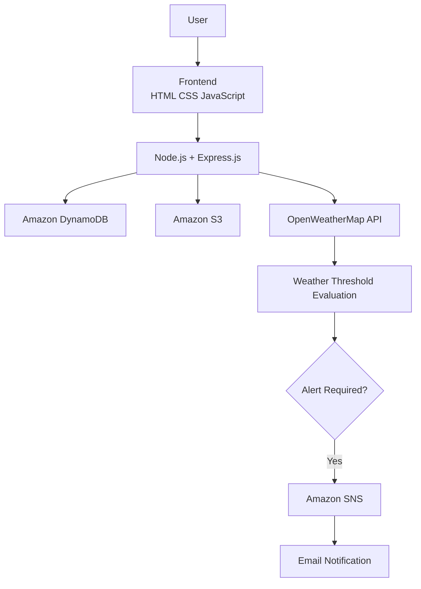

# 🚨 Weather Disaster Alert System


A cloud-based weather monitoring application that combines user authentication, AWS cloud services, and real-time weather analysis to notify approved users when severe weather conditions are detected.

---

## 🎯 Project Overview

This project demonstrates how multiple AWS services can work together in a practical web application.

Users register through the application, wait for administrator approval, and can then check weather conditions for a city. When predefined weather thresholds are exceeded, the application automatically publishes an alert through Amazon SNS, delivering an email notification to subscribed users.

---

## ⭐ Key Features

- User registration and login
- Password hashing using bcrypt
- Administrator approval workflow
- Weather monitoring using OpenWeatherMap API
- Weather threshold evaluation
- Email notifications through Amazon SNS
- User information stored in Amazon DynamoDB
- Signup data archived in Amazon S3

---

## 🔄 Application Workflow

```text
User
   │
   ▼
Signup
   │
   ▼
Store User → Amazon DynamoDB
   │
   ▼
Archive Signup → Amazon S3
   │
   ▼
Administrator Approval
   │
   ▼
Login
   │
   ▼
Enter City
   │
   ▼
OpenWeatherMap API
   │
   ▼
Evaluate Weather Conditions
(Rain ≥10 mm OR Wind >20 km/h)
   │
   ▼
Amazon SNS
   │
   ▼
Email Notification
```

---

## 🏗 System Architecture



---

## 🛠 Tech Stack

### Frontend

- HTML
- CSS
- JavaScript

### Backend

- Node.js
- Express.js

### Cloud Services

- Amazon DynamoDB
- Amazon S3
- Amazon SNS

### API

- OpenWeatherMap API

### Libraries

- Axios
- bcrypt
- dotenv
- cors
- archiver
- AWS SDK for JavaScript (v3)

---

## 📂 Project Structure

```text
.
├── public/
│   ├── index.html
│   ├── signup.html
│   ├── login.html
│   ├── dashboard.html
│
├── routes/
│   ├── auth.js
│   ├── admin.js
│   └── alerts.js
│
├── util/
│   └── zip.js
│
├── aws.js
├── server.js
├── package.json
├── .env.example
└── README.md
```

---

# 📸 Project Walkthrough

## 1️⃣ Application Interface

The web application provides user registration, login, and a dashboard for weather monitoring.


---

## 2️⃣ Backend Project Structure

The backend follows a modular Express.js structure with separate routes for authentication, administrator approval, and weather alerts.


---

## 3️⃣ Weather Alert Email

When rainfall or wind speed exceeds the configured threshold, Amazon SNS automatically publishes an email notification.

> Example shown below.


---

## ☁ AWS Services Used

| Service | Purpose |
|----------|---------|
| Amazon DynamoDB | Stores user information and approval status |
| Amazon S3 | Stores ZIP archives of signup records |
| Amazon SNS | Sends email notifications |
| OpenWeatherMap API | Provides live weather information |

---

## 🚀 Getting Started

### Clone

```bash
git clone https://github.com/YOUR_USERNAME/weather-disaster-alert-system.git
```

### Install

```bash
npm install
```

### Configure

Rename

```
.env.example
```

to

```
.env
```

and update the AWS credentials and OpenWeatherMap API key.

### Run

```bash
npm start
```

Open

```
http://localhost:3000
```

---

## 📚 What I Learned

This project helped me gain hands-on experience with:

- Building REST APIs using Express.js
- Integrating multiple AWS services
- Using DynamoDB for NoSQL storage
- Uploading application data to Amazon S3
- Sending notifications through Amazon SNS
- Working with external REST APIs
- Organizing backend code into modular routes

---

## 🚀 Future Improvements

- Support multiple cities
- Allow users to customize weather thresholds
- Display historical weather alerts
- Add SMS notifications
- Deploy on Amazon EC2
- Containerize using Docker

---

## 👩‍💻 Author

**Ayushi Sahai**

B.Tech Information Technology (2026)

AWS Certified Developer – Associate
