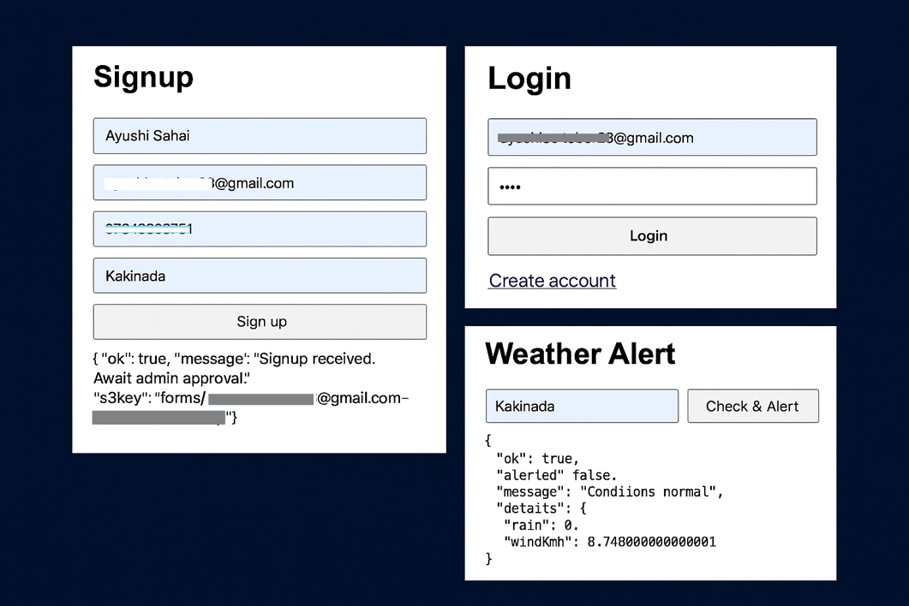
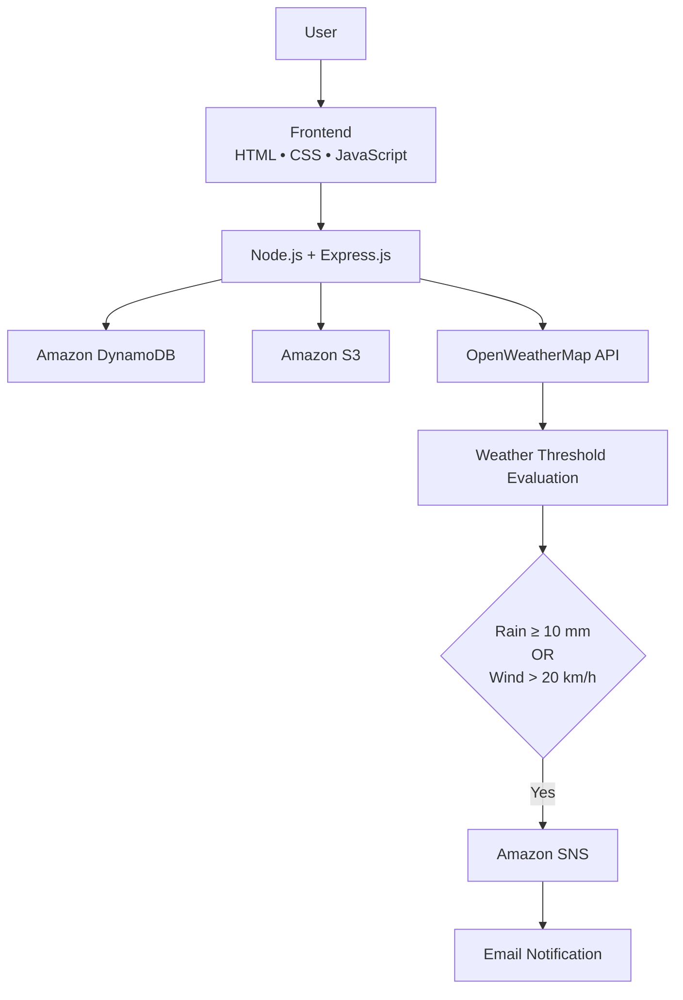
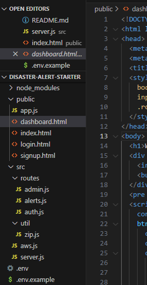
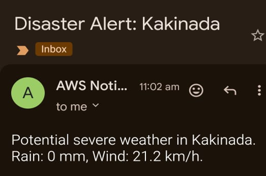

<div align="center">

# 🚨 Weather Disaster Alert System

A cloud-based weather monitoring application built with **Node.js**, **Express.js**, and **AWS** that monitors real-time weather conditions and automatically sends email alerts when severe weather thresholds are detected.

<p align="center">

</p>

<p>


</p>

</div>

---

# 📌 Project Status

| | |
|:--|:--|
| Status | ✅ Completed |
| Type | Personal Learning Project |
| Backend | Node.js + Express.js |
| Cloud Services | AWS DynamoDB • Amazon S3 • Amazon SNS |
| Weather Provider | OpenWeatherMap API |

---

# 📖 Overview

Weather Disaster Alert System is a backend-focused cloud application that combines user authentication, cloud storage, weather data retrieval, and automated notifications.

The application allows users to register, wait for administrator approval, log in, and request weather information for a city. When rainfall or wind speed exceeds predefined thresholds, the system automatically publishes an alert through Amazon SNS, delivering an email notification.

The project was built to gain practical experience integrating multiple AWS services into a single backend application.

---

# ✨ Highlights

| Authentication | Cloud Integration | Weather Processing | Notifications |
|:--|:--|:--|:--|
| User Signup & Login | Amazon DynamoDB | OpenWeatherMap API | Amazon SNS |
| Password Hashing | Amazon S3 | Threshold Evaluation | Email Alerts |
| Admin Approval | AWS SDK v3 | Live Weather Data | Automated Workflow |

---

# 🏗️ System Architecture



---

# 🔄 Application Workflow

```text
User
 │
 ▼
Signup
 │
 ▼
Store User → Amazon DynamoDB
 │
 ▼
Archive Signup → Amazon S3
 │
 ▼
Administrator Approval
 │
 ▼
Login
 │
 ▼
Enter City
 │
 ▼
Retrieve Weather → OpenWeatherMap API
 │
 ▼
Evaluate Rain & Wind Thresholds
 │
 ▼
Amazon SNS
 │
 ▼
Email Notification
```

---

# 📸 Project Showcase

## User Interface

The application provides a simple interface for user registration, login, and weather alert requests.

<p align="center">


</p>

---

## Backend Implementation

The backend follows a modular Express.js architecture with separate routes for authentication, administrator approval, and weather alerts.

<p align="center">



</p>

---

## Alert Notification

When severe weather conditions are detected, Amazon SNS automatically publishes an email notification.

<p align="center">



</p>

---

# ⚙️ Technology Stack

| Category | Technologies |
|:--|:--|
| Frontend | HTML, CSS, JavaScript |
| Backend | Node.js, Express.js |
| Database | Amazon DynamoDB |
| Object Storage | Amazon S3 |
| Notifications | Amazon SNS |
| Weather API | OpenWeatherMap API |
| Libraries | Axios, bcrypt, cors, dotenv, archiver, AWS SDK for JavaScript (v3) |

---

# ☁️ AWS Services Used

| AWS Service | Purpose |
|:--|:--|
| Amazon DynamoDB | Stores user information and approval status |
| Amazon S3 | Stores ZIP archives of signup data |
| Amazon SNS | Sends automated email notifications |

---

# 🔌 API Endpoints

| Method | Endpoint | Description |
|:--|:--|:--|
| POST | `/api/signup` | Register a new user |
| POST | `/api/login` | Login approved users |
| POST | `/api/admin/approve` | Approve or reject registered users |
| POST | `/api/weather-alert` | Retrieve weather data and evaluate alert conditions |

---

# ⚙️ Environment Variables

| Variable | Description |
|:--|:--|
| `AWS_REGION` | AWS Region |
| `AWS_ACCESS_KEY_ID` | AWS Access Key |
| `AWS_SECRET_ACCESS_KEY` | AWS Secret Key |
| `S3_BUCKET` | Amazon S3 Bucket |
| `DDB_TABLE` | DynamoDB Table |
| `SNS_TOPIC_ARN` | Amazon SNS Topic |
| `OPENWEATHER_KEY` | OpenWeatherMap API Key |

---

# 📂 Project Structure

```text
.
├── public/
│   ├── index.html
│   ├── signup.html
│   ├── login.html
│   ├── dashboard.html
│
├── routes/
│   ├── auth.js
│   ├── admin.js
│   └── alerts.js
│
├── util/
│   └── zip.js
│
├── aws.js
├── server.js
├── package.json
├── .env.example
└── README.md
```

---

# 🚀 Getting Started

Clone the repository

```bash
git clone https://github.com/YOUR_USERNAME/weather-disaster-alert-system.git
```

Install dependencies

```bash
npm install
```

Create an environment file

```bash
cp .env.example .env
```

Configure:

- AWS Credentials
- DynamoDB Table
- Amazon S3 Bucket
- Amazon SNS Topic
- OpenWeatherMap API Key

Run the project

```bash
npm start
```

Visit

```
http://localhost:3000
```

---

# 💡 Key Learning Outcomes

Working on this project helped me gain practical experience with:

- Building REST APIs using Express.js
- Structuring a modular backend application
- Integrating multiple AWS services
- Using Amazon DynamoDB for NoSQL data storage
- Uploading application data to Amazon S3
- Sending notifications with Amazon SNS
- Consuming third-party REST APIs
- Password hashing using bcrypt

---

# 🚀 Future Enhancements

- [ ] Support multiple cities
- [ ] Allow users to configure weather thresholds
- [ ] Store historical weather alerts
- [ ] Add SMS notifications
- [ ] Containerize the application using Docker
- [ ] Deploy on Amazon EC2

---

# 📄 License

This project is available under the MIT License.

---

<div align="center">

### 👩‍💻 Developed by

**Ayushi Sahai**

B.Tech Information Technology (2026)

AWS Certified Developer – Associate

</div>
