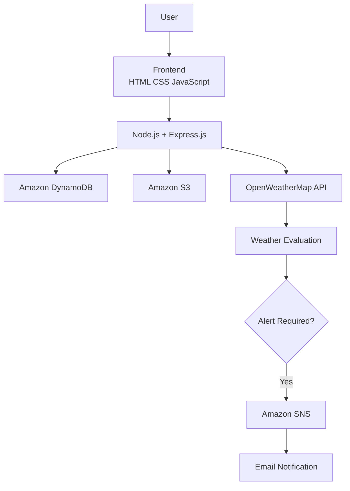

# 🚨 Weather Disaster Alert System


A cloud-based weather monitoring application that combines user authentication, AWS cloud services, and real-time weather analysis to notify approved users when severe weather conditions are detected.

---

## 🎯 Why I Built This

I wanted to build a project that combined backend development with cloud services in a practical scenario rather than using each technology in isolation.

This project helped me understand how different AWS services work together in a complete application—from storing user information to sending automated notifications based on live weather data.

---

## ✨ What It Does

- 👤 User registration and login
- 🔒 Password hashing using bcrypt
- ✅ Administrator approval workflow
- 🌦️ Real-time weather monitoring
- 📊 Automatic weather threshold evaluation
- 📧 Email alerts using Amazon SNS
- 🗄️ User management with Amazon DynamoDB
- 📦 Automatic backup of signup data to Amazon S3

---

## 🔄 Application Workflow

```text
User Registration
        │
        ▼
Store User → Amazon DynamoDB
        │
        ▼
Archive Signup → Amazon S3
        │
        ▼
Administrator Approval
        │
        ▼
User Login
        │
        ▼
Enter City
        │
        ▼
Fetch Weather → OpenWeatherMap API
        │
        ▼
Evaluate Weather Conditions
        │
        ▼
Rain ≥ 10 mm OR Wind > 20 km/h ?
        │
      Yes
        │
        ▼
Publish Notification → Amazon SNS
        │
        ▼
Email Alert
```

---

## 🏗️ System Architecture



---

## 🛠️ Tech Stack

### Frontend

- HTML
- CSS
- JavaScript

### Backend

- Node.js
- Express.js

### AWS Services

- Amazon DynamoDB
- Amazon S3
- Amazon SNS

### API

- OpenWeatherMap API

### Libraries

- Axios
- bcrypt
- dotenv
- cors
- archiver
- AWS SDK for JavaScript (v3)

---

## ☁️ AWS Services Used

| Service | Purpose |
|----------|---------|
| Amazon DynamoDB | Stores user information and approval status |
| Amazon S3 | Stores ZIP archives of signup data |
| Amazon SNS | Sends email notifications when alert conditions are met |

---

## 📁 Project Structure

```text
.
├── public/
├── routes/
├── util/
├── aws.js
├── server.js
├── package.json
├── .env.example
└── README.md
```

---

## 🚀 Getting Started

### Clone the repository

```bash
git clone https://github.com/yourusername/weather-disaster-alert-system.git
```

### Install dependencies

```bash
npm install
```

### Configure environment variables

Rename

```
.env.example
```

to

```
.env
```

and update the AWS and OpenWeatherMap credentials.

### Run the project

```bash
npm start
```

Open:

```
http://localhost:3000
```

---

## 📸 Screenshots

### Home Page

*(Add screenshot)*

### Signup

*(Add screenshot)*

### Login

*(Add screenshot)*

### Dashboard

*(Add screenshot)*

### Email Alert

*(Add screenshot)*

---

## 📚 What I Learned

Working on this project gave me practical experience with:

- Designing REST APIs using Express.js
- Integrating multiple AWS services into one application
- Using Amazon DynamoDB for NoSQL data storage
- Uploading application data to Amazon S3
- Publishing notifications with Amazon SNS
- Working with third-party APIs
- Structuring a backend application into reusable modules

---

## 🚀 Future Improvements

- Support multiple cities per user
- Allow users to configure custom alert thresholds
- Display historical weather alerts
- Add SMS notifications
- Deploy the application on Amazon EC2
- Containerize the application using Docker

---

## 👩‍💻 Author

**Ayushi Sahai**

B.Tech Information Technology (2026)

AWS Certified Developer – Associate

GitHub: https://github.com/YOUR_USERNAME

LinkedIn: https://linkedin.com/in/YOUR_PROFILE
