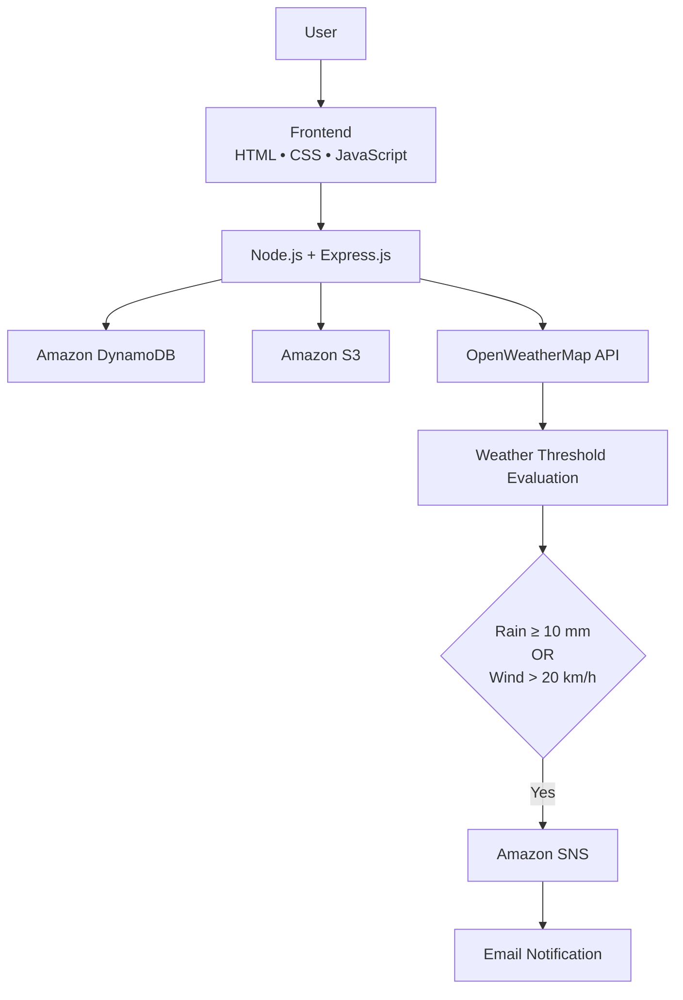

<div align="center">

# 🚨 Disaster Alert System

A cloud-based weather monitoring application built with **Node.js**, **Express.js**, and **AWS** that monitors real-time weather conditions and automatically sends email alerts when severe weather thresholds are detected.

<p>


</p>

<p align="center">

</p>


</div>

---

# 📌 Project Status

| | |
|:--|:--|
| Status | Functional |
| Type | Personal Learning Project |
| Backend | Node.js + Express.js |
| Cloud Services | AWS DynamoDB • Amazon S3 • Amazon SNS |


---

## 📖 Overview

Disaster Alert System is a backend-focused web application built with Node.js, Express.js, AWS, and the OpenWeatherMap API.

The application enables approved users to check weather conditions for a selected city. It retrieves live weather data, evaluates rainfall and wind speed against predefined thresholds, and sends email notifications through Amazon SNS when alert conditions are met.
User information is stored in Amazon DynamoDB, while signup data is archived in Amazon S3.

---
## 📝 How It Works

1. **User signs up** by providing their name, email, phone number, city, and password.

2. **Administrator reviews the account** and approves the user before they can access the application.

3. **Approved users log in** to the application.

4. **User enters a city name** to check the current weather conditions.

5. **The backend retrieves weather data** from the OpenWeatherMap API.

6. **The application evaluates weather conditions** against predefined rainfall and wind thresholds.

7. **If a threshold is exceeded**, Amazon SNS sends an email notification to the subscribed user.

8. **The user receives the weather alert** in their inbox.

---
## 🚀 Key Features

- User registration and login with secure password hashing
- Administrator approval before user access
- Live weather retrieval using the OpenWeatherMap API
- Weather evaluation based on rainfall and wind speed thresholds
- Automated email notifications using Amazon SNS
- User information stored in Amazon DynamoDB
- Signup data archived in Amazon S3
---

# ✨ Implementation Highlights

| Authentication | Cloud Integration | Weather Processing | Notifications |
|:--|:--|:--|:--|
| User Signup & Login | Amazon DynamoDB | OpenWeatherMap API | Amazon SNS |
| Password Hashing | Amazon S3 | Evaluate Weather | Email Alerts |
| Admin Approval | AWS SDK v3 | Live Weather Data | Automated Workflow |

---
# 📸 Project Showcase

## User Interface

The application provides a simple interface for user registration, login, and weather alert requests.

<p align="center">


</p>

---

## Backend Implementation

The backend follows a modular Express.js architecture with separate routes for authentication, administrator approval, and weather alerts.

<p align="center">


</p>

---

## Alert Notification

When severe weather conditions are detected, Amazon SNS automatically publishes an email notification.

<p align="center">


</p>

---
# 🏗️ System Architecture



---


# ⚙️ Technology Stack

| Category | Technologies |
|:--|:--|
| Frontend | HTML, CSS, JavaScript |
| Backend | Node.js, Express.js |
| Database | Amazon DynamoDB |
| Object Storage | Amazon S3 |
| Notifications | Amazon SNS |
| Weather API | OpenWeatherMap API |
| Libraries | Axios, bcrypt, cors, dotenv, archiver, AWS SDK for JavaScript (v3) |

---

# ☁️ AWS Services Used

| AWS Service | Purpose |
|:--|:--|
| Amazon DynamoDB | Stores user information and approval status |
| Amazon S3 | Stores ZIP archives of signup data |
| Amazon SNS | Sends automated email notifications |

---

# 🔌 API Endpoints

| Method | Endpoint | Description |
|:--|:--|:--|
| POST | `/api/signup` | Register a new user |
| POST | `/api/login` | Login approved users |
| POST | `/api/admin/approve` | Approve or reject registered users |
| POST | `/api/weather-alert` | Retrieve weather data and evaluate alert conditions |

---

# ⚙️ Environment Variables

| Variable | Description |
|:--|:--|
| `AWS_REGION` | AWS Region |
| `AWS_ACCESS_KEY_ID` | AWS Access Key |
| `AWS_SECRET_ACCESS_KEY` | AWS Secret Key |
| `S3_BUCKET` | Amazon S3 Bucket |
| `DDB_TABLE` | DynamoDB Table |
| `SNS_TOPIC_ARN` | Amazon SNS Topic |
| `OPENWEATHER_KEY` | OpenWeatherMap API Key |

---

# 🚀 Getting Started

Clone the repository

```bash
git clone https://github.com/YOUR_USERNAME/weather-disaster-alert-system.git
```

Install dependencies

```bash
npm install
```

Create an environment file

```bash
cp .env.example .env
```

Configure:

- AWS Credentials
- DynamoDB Table
- Amazon S3 Bucket
- Amazon SNS Topic
- OpenWeatherMap API Key

Run the project

```bash
npm start
```

Visit

```
http://localhost:3000
```
---

# 🚀 Future Enhancements

- Add additional disaster types
- Improve alert customization
- Add monitoring and analytics
---

# 📄 License

This project is available under the MIT License.

---

<div align="center">

### 👩‍💻 Developed by

**Ayushi Sahai**

B.Tech Information Technology (2026)

AWS Certified Developer – Associate

</div>
