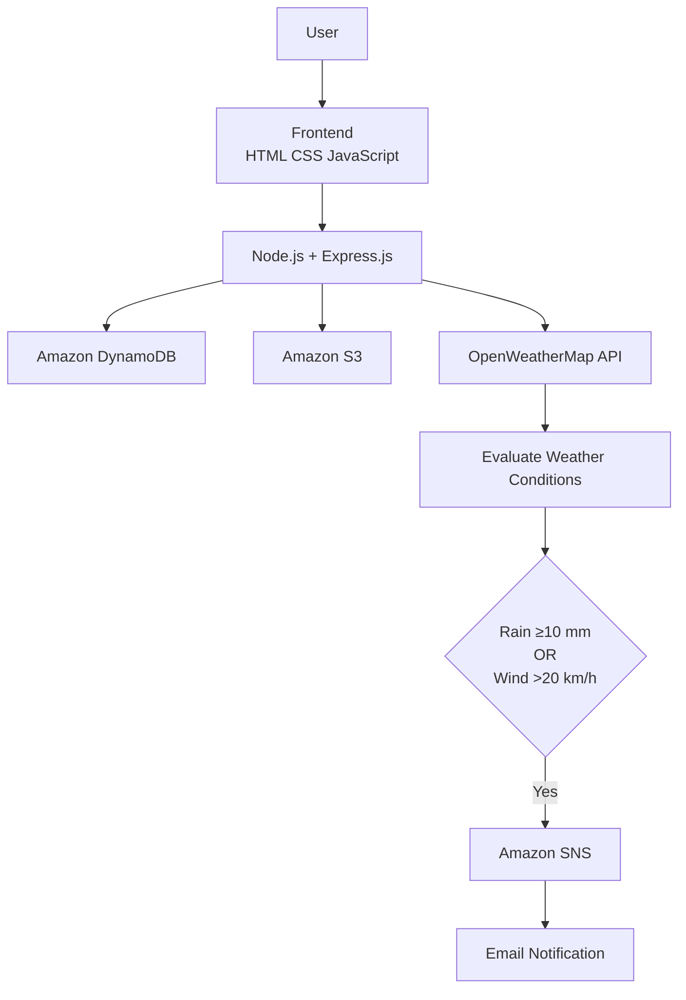

<h1 align="center">
🚨 Weather Disaster Alert System
</h1>

<p align="center">

Cloud-based weather monitoring application built with
Node.js • Express.js • AWS • OpenWeatherMap API

</p>

<p align="center">


</p>

<p align="center">

badges...

</p>

</div>

---

# 📌 Overview

This project demonstrates how multiple AWS cloud services can work together in a real-world backend application.

The application allows users to register, receive administrator approval, log in, and request weather information for a city. Whenever rainfall or wind speed exceeds predefined thresholds, the system automatically publishes an alert using **Amazon SNS**, delivering an email notification.

---

# ✨ Highlights

| Authentication | Cloud Integration | Weather Monitoring | Notifications |
|:--------------|:-----------------|:------------------|:--------------|
| User Signup & Login | Amazon DynamoDB | OpenWeatherMap API | Amazon SNS |
| Password Hashing | Amazon S3 | Threshold Evaluation | Email Alerts |
| Admin Approval | AWS SDK v3 | Live Weather Data | Automated Workflow |

---

# 🏗️ System Architecture



---

# 🔄 Application Workflow

```text
User
 │
 ▼
Signup
 │
 ▼
Store User → Amazon DynamoDB
 │
 ▼
Archive Signup → Amazon S3
 │
 ▼
Administrator Approval
 │
 ▼
Login
 │
 ▼
Enter City
 │
 ▼
Fetch Weather
 │
 ▼
Evaluate Thresholds
 │
 ▼
Amazon SNS
 │
 ▼
Email Notification
```

---

# 📸 Project Showcase

## Application

The application provides a simple workflow for user registration, login, and weather monitoring.

<p align="center">


</p>

---

## Backend Structure

The project follows a modular Express.js architecture with separate routes for authentication, administration, and weather alerts.

<p align="center">


</p>

---

## Email Notification

When severe weather conditions are detected, Amazon SNS automatically sends an email notification.

<p align="center">


</p>

---

# ⚙️ Technology Stack

| Category | Technologies |
|:---------|:-------------|
| Frontend | HTML, CSS, JavaScript |
| Backend | Node.js, Express.js |
| Database | Amazon DynamoDB |
| Object Storage | Amazon S3 |
| Notifications | Amazon SNS |
| Weather API | OpenWeatherMap API |
| Libraries | Axios, bcrypt, cors, dotenv, archiver, AWS SDK v3 |

---

# ☁️ AWS Services

| Service | Purpose |
|:--------|:--------|
| Amazon DynamoDB | Stores user information and approval status |
| Amazon S3 | Stores ZIP archives of signup data |
| Amazon SNS | Sends weather alert email notifications |

---

# 📂 Project Structure

```text
.
├── public/
│   ├── index.html
│   ├── signup.html
│   ├── login.html
│   ├── dashboard.html
│
├── routes/
│   ├── auth.js
│   ├── admin.js
│   └── alerts.js
│
├── util/
│   └── zip.js
│
├── aws.js
├── server.js
├── package.json
├── .env.example
└── README.md
```

---

# 🚀 Getting Started

Clone the repository

```bash
git clone https://github.com/YOUR_USERNAME/weather-disaster-alert-system.git
```

Install dependencies

```bash
npm install
```

Create a `.env` file using `.env.example` and configure:

- AWS Credentials
- DynamoDB Table
- S3 Bucket
- SNS Topic ARN
- OpenWeatherMap API Key

Run the project

```bash
npm start
```

Open

```
http://localhost:3000
```

---

# 💡 What I Learned

During this project I gained practical experience with:

- Designing REST APIs using Express.js
- Building a modular backend architecture
- Integrating Amazon DynamoDB, S3, and SNS into one application
- Working with external REST APIs
- Password hashing using bcrypt
- Handling cloud-based storage and notifications
- Structuring backend applications using reusable route modules

---

# 🚀 Roadmap

- [ ] Support multiple cities
- [ ] Allow custom weather thresholds
- [ ] Store weather alert history
- [ ] Add SMS notifications
- [ ] Dockerize the application
- [ ] Deploy to Amazon EC2

---

<div align="center">

### 👩‍💻 Developed by

**Ayushi Sahai**

B.Tech Information Technology (2026)

AWS Certified Developer – Associate

</div>
